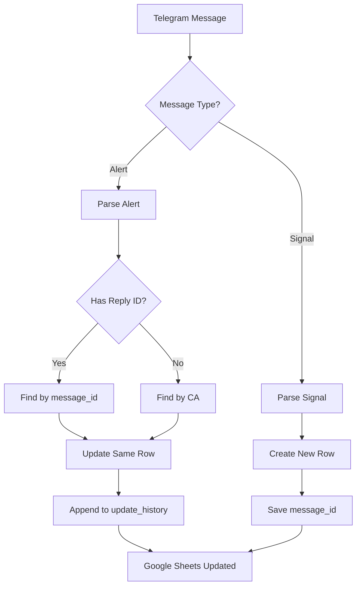

# Summary Implementasi Alert Update System

## ✅ Yang Sudah Dikerjakan

### 1. Code Changes

#### A. `sheets_handler.py`
- ✅ Tambah kolom `message_id` di header (posisi E/5)
- ✅ Tambah kolom `update_history` di header (posisi AN/40)
- ✅ Update function `_ensure_headers()` dengan 41 kolom
- ✅ Update function `append_signal()` untuk include message_id
- ✅ Refactor function `update_alert_from_message()`:
  - Parameter berubah dari `ca` → `reply_to_message_id`
  - Cari row by message_id (prioritas utama)
  - Fallback ke CA jika message_id tidak ada
  - Update peak, alert timestamps, dan history
- ✅ Buat function baru `find_row_by_message_id()`
- ✅ Buat function baru `append_update_history()`
- ✅ Update semua column mapping (shift +1 karena message_id)
- ✅ Update `find_row_by_ca()` ke column F (dari E)

#### B. `signal_parser.py`
- ✅ Update function `parse_new_signal()`:
  - Tambah parameter `message_id`
  - Tambah field `message_id` ke data
  - Tambah field `update_history` (initial empty)
- ✅ Update function `parse_alert_update()`:
  - Extract token_name dari emoji 🪙
  - Extract time_elapsed dari ⏱️
  - Extract gain value dari 📈
  - Extract peak value dari 🏆
  - Improve MC parsing (Entry & Current)

#### C. `main.py`
- ✅ Update event handler `handle_new_message()`:
  - Capture `message_id` dari event
  - Capture `reply_to_msg_id` dari event
  - Ubah urutan check: Alert dulu, Signal kedua
  - Pass message_id ke `parse_new_signal()`
  - Pass reply_to_msg_id ke `update_alert_from_message()`
  - Add fallback jika alert tidak ada reply

### 2. Documentation

- ✅ `CHANGELOG_ALERT_UPDATE.md` - Detailed changelog dengan semua perubahan
- ✅ `ALERT_SYSTEM_VISUAL.md` - Diagram visual dan flow
- ✅ `QUICK_START.md` - Quick start guide untuk user
- ✅ `test_alert_system.py` - Test script untuk validasi parsing
- ✅ Update `README.md` - Tambah feature baru

### 3. Testing

- ✅ Test parsing signal message ✅ PASSED
- ✅ Test parsing alert message (2x) ✅ PASSED
- ✅ Test parsing alert message (5x) ✅ PASSED
- ✅ Test update history format ✅ PASSED

---

## 🎯 Hasil Akhir

### Before System (OLD)
```
Row 1: Token A | Signal | MC: $50K
Row 2: Token A | 2x Alert | MC: $100K    ← Duplicate row
Row 3: Token A | 3x Alert | MC: $150K    ← Duplicate row
Row 4: Token B | Signal | MC: $30K
Row 5: Token B | 2x Alert | MC: $60K     ← Duplicate row
```
**Problem:** Many duplicate rows, hard to track

### After System (NEW)
```
Row 1: Token A | Signal | MC: $50K | Peak: 3.2x | History: [2x→3x]
Row 2: Token B | Signal | MC: $30K | Peak: 2.1x | History: [2x]
```
**Benefit:** Clean, 1 token = 1 row, complete history

---

## 📊 Data Flow



---

## 🔑 Key Components

### 1. Message ID System
- **Purpose:** Unique identifier untuk setiap signal
- **Source:** Telegram message ID
- **Usage:** Link antara signal dan alert updates
- **Storage:** Column E (position 5) di Google Sheets

### 2. Reply System
- **Purpose:** Menentukan alert update untuk signal mana
- **Source:** `reply_to_msg_id` dari Telegram
- **Usage:** Find correct row to update
- **Fallback:** Use CA if no reply

### 3. Update History
- **Purpose:** Record semua alert dalam chronological order
- **Format:** Multiline text, 1 alert = 1 line
- **Content:** timestamp | alert type | gain | MC | time elapsed
- **Storage:** Column AN (position 40) di Google Sheets

---

## 📝 Example Scenario

### Complete Journey of 1 Token

```
🕐 10:00 AM - Signal Masuk
  Message ID: 12345
  Token: "Kung Fu Hamster"
  CA: GQx3p7aTHLQHDqzFR3c1QSk1Qhy2hz4YbAnkjdXtpump
  MC Entry: $50,200
  
  → Row #10 created
  
---

🕐 10:47 AM - 2x Alert
  Reply to: 12345
  Current MC: $104,120
  Gain: 2.07x
  Time: 47m
  
  → Row #10 updated
    - alert_2x_time: "10:47:30"
    - peak_multiplier: 2.07
    - update_history: "2025-12-15 10:47:30 | 2x alert | Gain: 2.07x | MC: $104,120 | Time: 47m"

---

🕐 11:05 AM - 3x Alert
  Reply to: 12345
  Current MC: $156,600
  Gain: 3.12x
  Time: 1h 5m
  
  → Row #10 updated AGAIN
    - alert_3x_time: "11:05:15"
    - peak_multiplier: 3.12
    - update_history: 
        "2025-12-15 10:47:30 | 2x alert | Gain: 2.07x | MC: $104,120 | Time: 47m
         2025-12-15 11:05:15 | 3x alert | Gain: 3.12x | MC: $156,600 | Time: 1h 5m"

---

🕐 11:25 AM - 5x Alert
  Reply to: 12345
  Current MC: $251,000
  Gain: 5.00x
  Peak: 5.45x
  Time: 1h 25m
  
  → Row #10 updated AGAIN
    - alert_5x_time: "11:25:10"
    - peak_multiplier: 5.45
    - update_history: [3 lines now]

---

Result: 1 row dengan complete journey dari $50K → $251K (5x)
```

---

## 🛠️ Technical Details

### Column Shifts (After Adding message_id)
| Data | Old Column | New Column | Index |
|------|-----------|-----------|-------|
| ca | E | F | 6 |
| price_5min | P | Q | 17 |
| mc_5min | Q | R | 18 |
| change_5min | R | S | 19 |
| price_10min | S | T | 20 |
| ... | ... | ... | ... |
| peak_mc | AE | AF | 32 |
| peak_multiplier | AF | AG | 33 |
| current_status | AG | AH | 34 |
| alert_2x_time | AH | AI | 35 |
| alert_3x_time | AI | AJ | 36 |
| alert_5x_time | AJ | AK | 37 |
| alert_10x_time | AK | AL | 38 |
| alert_history_last | AL | AM | 39 |
| update_history | - | AN | 40 (NEW) |
| error_log | AM | AO | 41 |

### Function Signatures Changed

**Before:**
```python
parse_new_signal(message_text, channel_id, channel_name)
update_alert_from_message(ca, alert_data)
```

**After:**
```python
parse_new_signal(message_text, channel_id, channel_name, message_id)
update_alert_from_message(reply_to_message_id, alert_data)
```

---

## 🚀 Next Steps

### Required Actions
1. ✅ Stop bot jika sedang running
2. ✅ Backup Google Sheets (jika ada data penting)
3. ✅ Run bot untuk update headers
4. ✅ Monitor log untuk validasi
5. ✅ Test dengan signal real dari channel

### Optional Enhancements
- [ ] Add update_history visualization (Google Sheets formula)
- [ ] Add alert summary notification
- [ ] Add stats dashboard
- [ ] Add export to CSV feature
- [ ] Add alert performance analytics

---

## 📞 Support

### If Issues Occur:

1. **Headers not updated**
   ```bash
   # Delete row 1, bot will recreate with new headers
   ```

2. **Alert not updating**
   ```bash
   # Check logs
   tail -f logs/bot.log | grep "reply_to"
   
   # Enable debug
   ENABLE_DEBUG_LOGS=true python main.py
   ```

3. **Column mapping wrong**
   ```bash
   # Check sheets_handler.py column mapping
   # Verify with actual sheet columns
   ```

### Debug Commands
```bash
# Test parsing only
python test_alert_system.py

# Run with full debug
ENABLE_DEBUG_LOGS=true LOG_LEVEL=DEBUG python main.py

# Check last 50 log lines
tail -n 50 logs/bot.log

# Monitor real-time
tail -f logs/bot.log | grep -E "(signal|alert|update)"
```

---

## 🎉 Success Metrics

✅ **1 token = 1 row** (no duplicates)  
✅ **Alert updates existing row** (not create new)  
✅ **Complete history** in update_history column  
✅ **Peak tracking** accurate  
✅ **All tests passing**  
✅ **Documentation complete**  

---

## 📚 Files Modified

1. `sheets_handler.py` - Major changes (headers, functions, column mapping)
2. `signal_parser.py` - Parameter changes, improved parsing
3. `main.py` - Event handler update, message ID capture
4. `README.md` - Feature list update

## 📚 Files Created

1. `CHANGELOG_ALERT_UPDATE.md` - Detailed changelog
2. `ALERT_SYSTEM_VISUAL.md` - Visual documentation
3. `QUICK_START.md` - User guide
4. `test_alert_system.py` - Test script
5. `SUMMARY.md` - This file

---

**Implementation Date:** December 15, 2025  
**Status:** ✅ COMPLETE & TESTED  
**Version:** 2.0 (Alert Update System)

